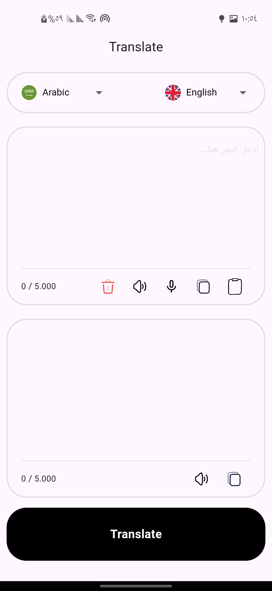
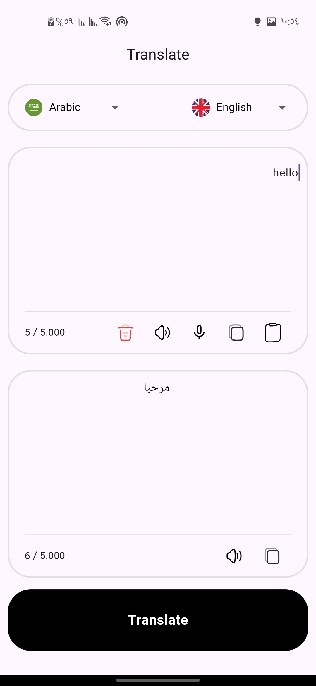
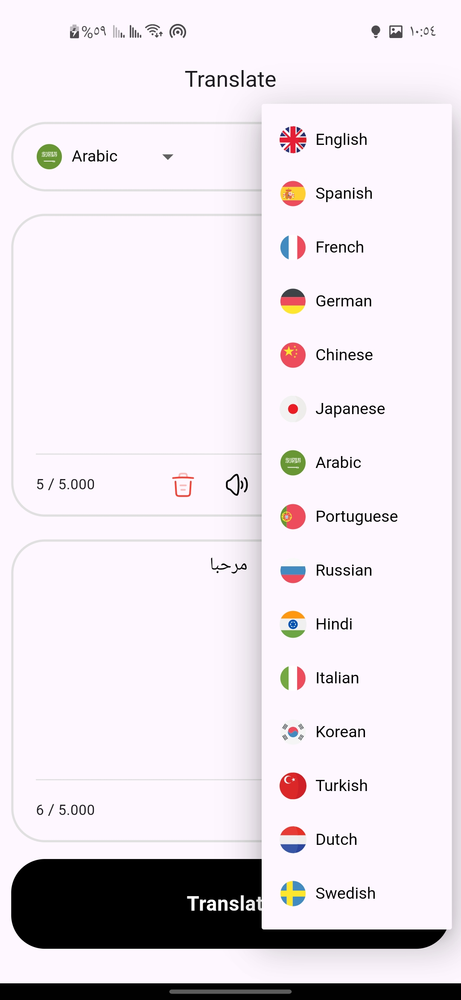
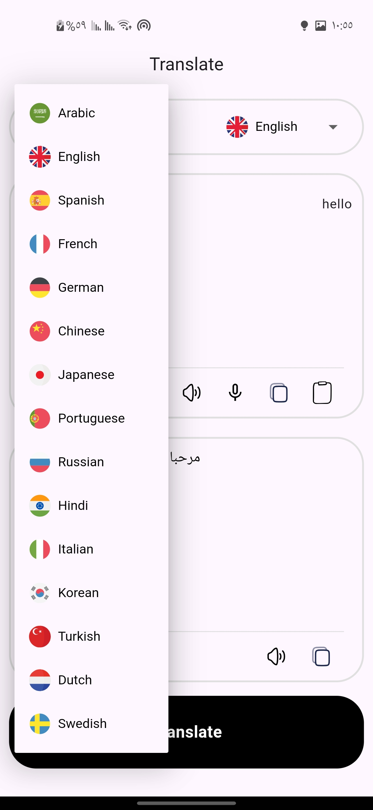

# instantaneous_translation

A Flutter application for instantaneous text translation using Google Gemini API.

## About The Project

**instantaneous_translation** is a simple yet powerful Flutter application designed to provide an instantaneous text translation experience. The project leverages the capabilities of the [Google Gemini API](https://developers.generativeai.google/) to process and translate user-inputted text in real-time.

**Why was this project created?**

This application was developed as a practical and illustrative example demonstrating how to integrate and utilize Generative AI models, specifically the Google Gemini API, within a mobile application built using Flutter. The project aims to help developers understand the basic workflow of interacting with APIs like Gemini for text processing and translation tasks.

## Screenshots









## Prerequisites

Before running this application, ensure you have the following installed and set up:

1.  **Flutter SDK**: Make sure you have the [Flutter SDK](https://flutter.dev/docs/get-started) installed and configured on your machine.
2.  **Google Cloud Project**: You might need a valid Google Cloud project to obtain a Gemini API key.
3.  **Google Gemini API Key**: This application is crucial for the application to function. It requires an API key to interact with the Gemini service. If you don't have a key, you can create one by following the steps outlined in the [Google AI for Developers documentation](https://developers.generativeai.google/tutorials/setup).

## How To Run

Follow these steps to get the application running on your device or emulator:

1.  **Clone the repository**:
    ```bash
    git clone <your_repository_url_here> # Replace with your project's repository URL if available
    cd instantaneous_translation
    ```

2.  **Install dependencies**:
    Run the following command to fetch all the necessary packages and dependencies for the project:
    ```bash
    flutter pub get
    ```

3.  **Get your Gemini API Key**:
    As mentioned in the Prerequisites section, you need a Gemini API key. Make sure you have obtained a valid key from the [Google AI console](https://developers.generativeai.google/tutorials/setup).

4.  **Run the application with the API Key**:
    **This is a crucial step.** You must provide your Gemini API key when running the application. We do this using the `--dart-define` flag to pass the API key as an environment variable available in the Dart code during runtime.

    Use the following command, replacing `YOUR_API_KEY_HERE` with your actual API key:

    ```bash
    flutter run --dart-define=GEMINI_API_KEY=YOUR_API_KEY_HERE
    ```

    *   **Command Explanation:**
        *   `flutter run`: Starts the application execution process.
        *   `--dart-define`: A flag used to define variables in the Dart build and runtime environment.
        *   `GEMINI_API_KEY=YOUR_API_KEY_HERE`: This is the key-value pair we are defining. Inside your Flutter code, you can access this string variable using `const String.fromEnvironment('GEMINI_API_KEY')`.

    **Important Note:** Passing the API key this way is safe for local development or testing as it's passed to the Dart process and not directly embedded in the source code that might be pushed to a public repository. However, in production environments, it's strongly recommended to use more secure methods for managing API keys, such as using backend services to make sensitive API calls.

## Additional Resources for Learning Flutter

If you are new to Flutter, these resources might be helpful to get started:

-   [Lab: Write your first Flutter app](https://docs.flutter.dev/get-started/codelab)
-   [Cookbook: Useful Flutter samples](https://docs.flutter.dev/cookbook)

For help getting started with Flutter development, view the
[online documentation](https://docs.flutter.dev/), which offers tutorials,
samples, guidance on mobile development, and a full API reference.

---